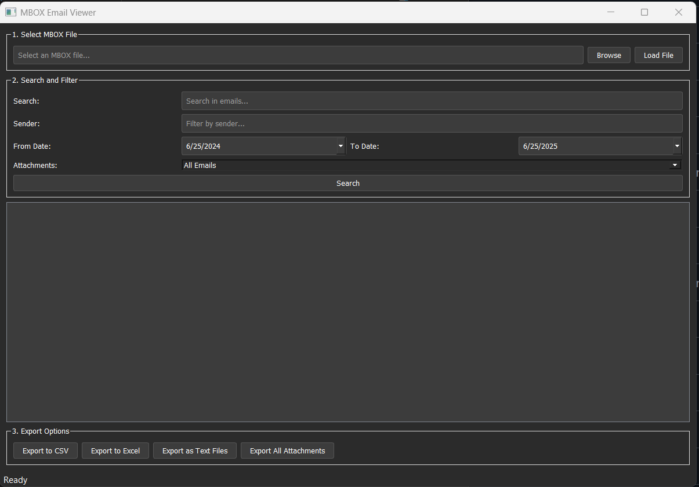

# MBOX Email Viewer

A Windows desktop application for viewing, searching, and extracting emails and attachments from MBOX files (Google Takeout format).

## Features

- 📧 Load and parse MBOX files from Google Takeout
- 🔍 Search emails by content, sender, subject
- 📅 Filter by date range
- 📎 Filter by attachment presence
- 💾 Export to CSV, Excel, or individual text files
- 📦 Extract attachments in their original formats
- 🖥️ Native Windows desktop application
- 🌙 Modern dark theme UI
- ⌨️ Keyboard shortcuts (Enter to search)

## Download

Download the latest installer from the [Releases](https://github.com/jwolf842/mbox-email-viewer/releases) page.

## Installation

1. Download `MBOX_Email_Viewer_Setup_1.0.0.exe` from the latest release
2. Run the installer
3. Follow the installation wizard
4. Launch MBOX Email Viewer from your Start Menu or Desktop

## Usage

### Loading an MBOX File
1. Click "Browse" to select your MBOX file
2. Click "Load File" to process the emails
3. Wait for processing to complete (progress bar shows status)

### Searching and Filtering
- **Search**: Enter keywords to search in email content
- **Sender Filter**: Filter by sender email address
- **Date Range**: Select start and end dates
- **Attachments**: Filter to show only emails with/without attachments
- **Tip**: Press Enter in search fields to quickly execute search

### Viewing Emails
- Double-click any email in the results to view details
- View attachments within each email
- Extract individual attachments or all at once

### Exporting Data
- **Export to CSV**: Creates a spreadsheet with email metadata
- **Export to Excel**: Creates an Excel file with multiple sheets
- **Export as Text Files**: Saves each email as a separate text file
- **Export All Attachments**: Extracts all attachments from search results

## System Requirements

- Windows 10 or Windows 11
- 4GB RAM minimum (8GB recommended for large MBOX files)
- 100MB free disk space (plus space for your MBOX files)

## Building from Source

See [DEVELOPMENT.md](DEVELOPMENT.md) for build instructions.

## Contributing

Pull requests are welcome! For major changes, please open an issue first to discuss what you would like to change.

## License

This project is licensed under the MIT License - see the [LICENSE](LICENSE) file for details.

## Acknowledgments

- Built with Python and PyQt5
- Uses pandas for data processing

## 🐛 Reporting Issues

Found a bug or have a feature request? Please [open an issue](https://github.com/jwolf842/mbox-email-viewer/issues/new/choose)!

Before opening an issue:
- Check [existing issues](https://github.com/jwolf842/mbox-email-viewer/issues) to avoid duplicates
- Use the provided templates for best results
- Include as much detail as possible

See [CONTRIBUTING.md](CONTRIBUTING.md) for development guidelines.

## Support

If you encounter any issues, please [open an issue](https://github.com/jwolf842/mbox-email-viewer/issues) on GitHub.
